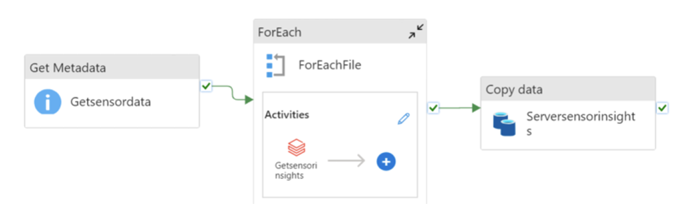
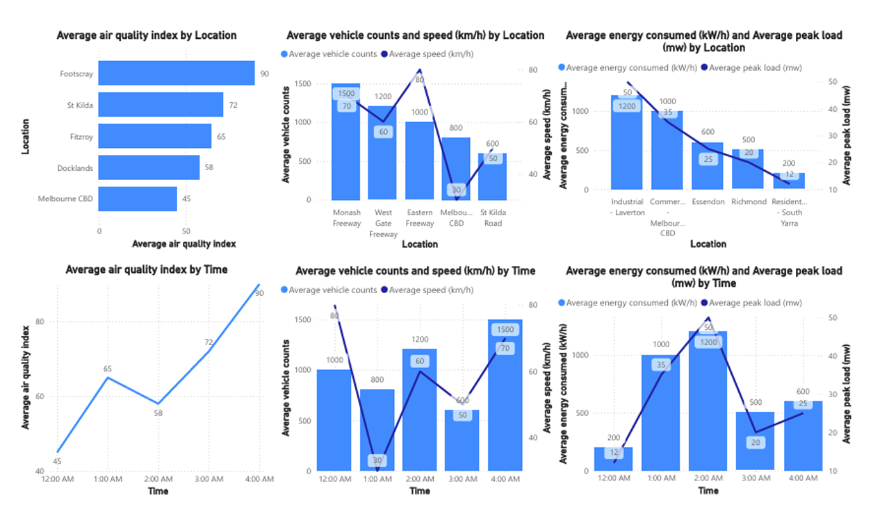

# Smart City Big Data Processing Pipeline

This repository showcases a data pipeline project for a smart city initiative. The project ingests, processes, and analyzes real-time IoT sensor data to provide actionable insights for city planners.

## Project Overview
The pipeline consists of:
1. **Data Ingestion**: Azure Data Factory extracts raw sensor data from Azure Blob Storage.
2. **Data Processing**: Databricks calculates metrics like air quality index, traffic density, and energy consumption.
3. **Data Storage**: Structured data is stored in Cosmos DB for fast querying.
4. **Visualization**: Power BI dashboards highlight key insights.

## Project Components
- **Azure Data Factory**: Orchestrates data movement from Blob Storage to Databricks.
- **Azure Databricks**: Processes and analyzes IoT sensor data.
- **Cosmos DB**: Stores processed data for scalability and querying.
- **Power BI**: Visualizes insights for decision-making.

## Repository Structure

- **data/**: Contains sample IoT sensor data.
- **notebooks/**: Databricks notebooks for data ingestion and processing.
- **PowerBI/**: Power BI dashboard files.
- **images/**: Screenshots of setup and pipeline
- **docs/**: Pipilines and additional project documentation.
- **README.md**: Main project description and instructions.

## Setup Instructions
1. **Azure Configuration**:
   - Create Blob Storage for raw sensor data.
   - Configure Data Factory pipelines for data extraction and ingestion.
   - Set up Databricks workspace and import notebooks.

2. **Run Databricks Notebook**:
   - Use the provided notebooks to process the data.
   - Calculate metrics like air quality index, traffic density, and energy consumption.

3. **Store Data in Cosmos DB**:
   - Use the provided scripts to upload structured data to Cosmos DB.

4. **Power BI Dashboard**:
   - Import the `PowerBI/SmartCityDashboard.pbix` file to view insights.
   - Customize as needed for your analysis.

## Key Features
- Real-time data ingestion and processing.
- Visualization of actionable insights for smart city planning.
- Scalable storage and querying using Cosmos DB.

## Demo

## Future Enhancements
- Integrate machine learning models for predictive analytics.
- Add automated alerts for pollution or traffic anomalies.

## Author
**Nhu Huynh**  
- [LinkedIn](https://www.linkedin.com/in/nhuhuynhh/)  
- [Email](mailto:nhuthituyet.huynh@gmail.com)

